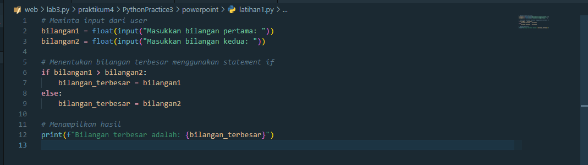
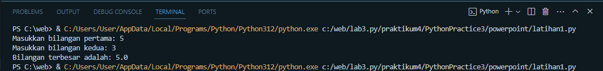
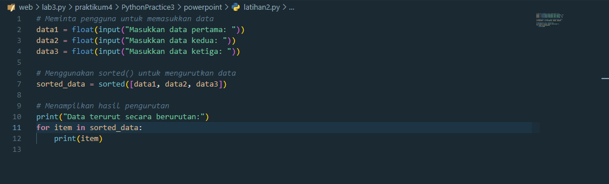
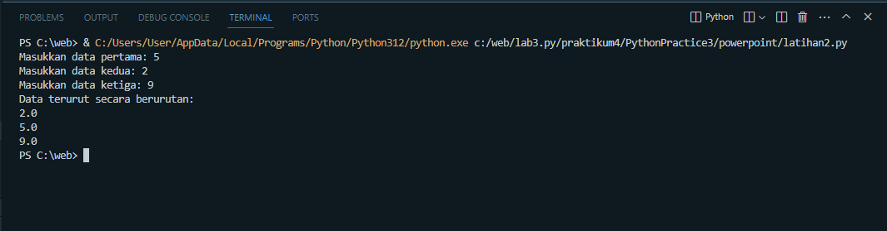
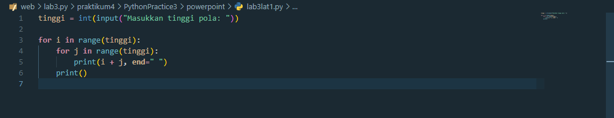
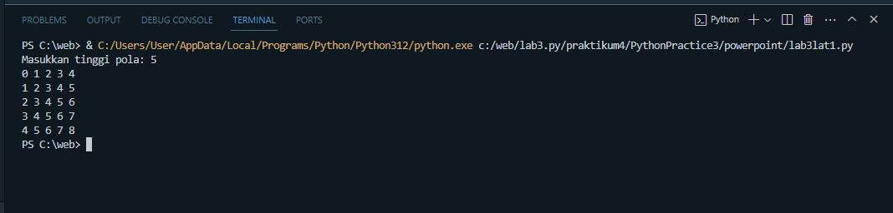
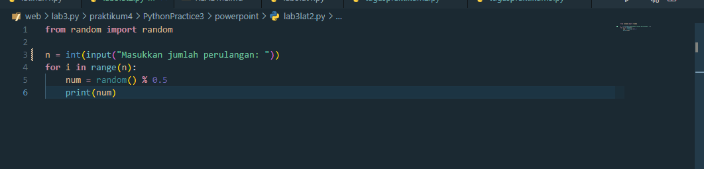
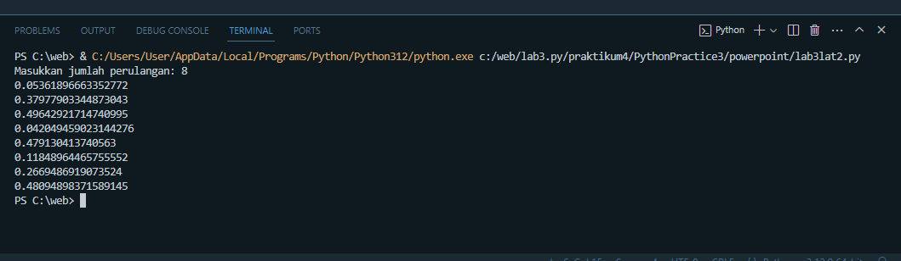

# PythonPractice3

## Power Point

* Latihan 1

**Meminta Input**

    bilangan1 = float(input("Masukkan bilangan pertama: "))
    bilangan2 = float(input("Masukkan bilangan kedua: "))

Program meminta pengguna untuk memasukkan dua bilangan. Fungsi input digunakan untuk mendapatkan input dari pengguna, dan float digunakan untuk mengonversi input menjadi tipe data float, karena kita ingin memasukkan bilangan desimal.

**Menentukan Bilangan Terbesar**

    if bilangan1 > bilangan2:
        bilangan_terbesar = bilangan1
    else:
        bilangan_terbesar = bilangan2

Dalam blok ini, kita menggunakan statement if untuk membandingkan bilangan1 dan bilangan2. Jika bilangan1 lebih besar dari bilangan2, maka bilangan_terbesar diisi dengan nilai bilangan1, dan jika tidak, diisi dengan nilai bilangan2.

**Menampilkan Hasil**

    print(f"Bilangan terbesar adalah: {bilangan_terbesar}")

Program kemudian menampilkan hasilnya dengan menggunakan fungsi print. Kita menggunakan f-string untuk menyisipkan nilai dari variabel bilangan_terbesar ke dalam string.

Ini Tampilan Hasil Outputnya

* Latihan 2

**Meminta Input**

    data1 = float(input("Masukkan data pertama: "))
    data2 = float(input("Masukkan data kedua: "))
    data3 = float(input("Masukkan data ketiga: "))

Program meminta pengguna untuk memasukkan tiga data. Fungsi input digunakan untuk mendapatkan input dari pengguna, dan float digunakan untuk mengonversi input menjadi tipe data float.

**Menggunakan sorted() untuk Mengurutkan Data**

    sorted_data = sorted([data1, data2, data3])

Menggunakan fungsi sorted() untuk mengurutkan data dalam bentuk list yang terbentuk dari input pengguna.

**Menampilkan Hasil Pengurutan**

    print("Data terurut secara berurutan:")
    for item in sorted_data:
        print(item)

Program kemudian menampilkan hasil pengurutan dalam urutan dari terkecil ke terbesar menggunakan loop for.

Ini Tampilan Hasil Outputnya

* Lab 3 Latihan 1

**Meminta Input Pola**

    tinggi = int(input("Masukkan tinggi pola: "))

Program meminta pengguna untuk memasukkan tinggi pola yang diinginkan.

**Perulangan Pertama(i)**

    for i in range(tinggi):

Perulangan pertama digunakan untuk mengontrol baris pada pola. Nilai i akan berjalan dari 0 hingga tinggi - 1.

**Perulangan Kedua(j)**

    for j in range(tinggi):

Perulangan kedua digunakan untuk mengontrol kolom pada setiap baris pola. Nilai j akan berjalan dari 0 hingga tinggi - 1.

**Mencetak Jumlah i dan j**

    print(i + j, end=" ")

Pernyataan ini mencetak jumlah i dan j pada setiap posisi dalam pola. Penggunaan end=" " digunakan agar setiap angka dicetak dalam satu baris.

Ini Tampilan Hasil Outputnya

* Lab 3 Latihan 2

**Import Modul random**

    from random import random

Menggunakan pernyataan from ... import ... untuk mengimpor fungsi random dari modul random.
Modul random digunakan untuk menghasilkan bilangan acak.

**Minta Jumlah Perulangan dari Pengguna**

    n = int(input("Masukkan jumlah perulangan: "))

Menggunakan fungsi input untuk meminta pengguna memasukkan jumlah perulangan.
Menggunakan fungsi int untuk mengonversi input pengguna ke tipe data integer.

**Loop untuk Menghasilkan Bilangan Acak dan Mencetaknya**

    for i in range(n):
        num = random() % 0.5
        print(num)

Menggunakan loop for untuk melakukan iterasi sebanyak n kali.
Pada setiap iterasi, menggunakan fungsi random() dari modul random untuk menghasilkan bilangan acak antara 0 dan 1.
Menggunakan operator modulo (%) untuk mendapatkan nilai sisa pembagian hasil random() dengan 0.5. Hal ini akan menghasilkan bilangan acak antara 0 dan 0.5.
Mencetak bilangan acak yang dihasilkan.

Ini Tampilan Hasil Outputnya

